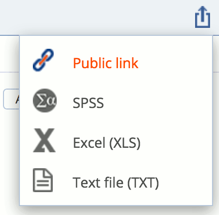
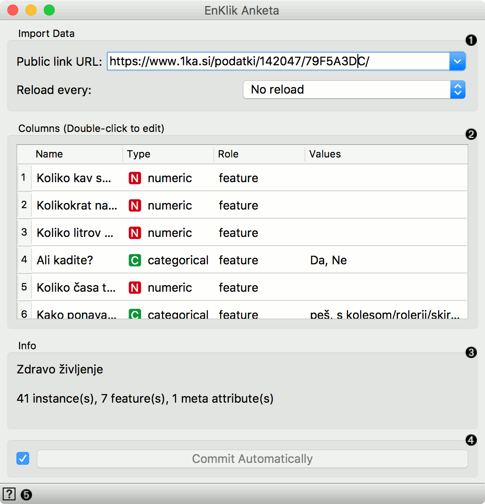
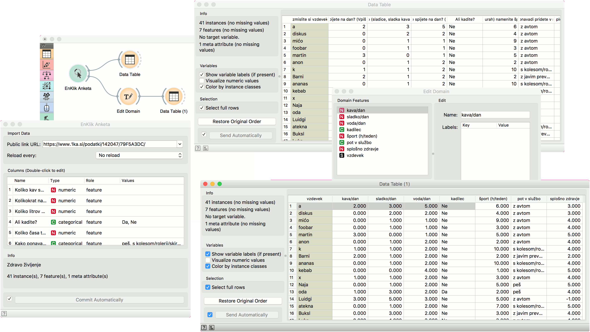

EnKlik Anketa
=============

Import data from EnKlikAnketa (1ka.si) public URL.

Inputs
    None

Outputs
    Data
        survey results

The **EnKlik Anketa** widget retrieves survey results obtained from the `EnKlikAnketa <http://english.1ka.si/>`_ service. You need to create a public link to to retrieve the results. Go to the survey you wish to retrieve, then select Data (Podatki) tab and create a public link (javna povezava) at the top right corner. 

Then insert the link into the Public link URL field. The link should look something like this: https://www.1ka.si/podatki/123456/78A9B1CD/.

1. A public link to the survey results. To observe the results live, set the reload rate (5s - 5 min).
2. Attribute list. You can change the attribute type and role, just like in the **File** widget.
3. Survey meta information.
4. Tick the box on the left to commit the changes automatically. Alternatively, click *Commit*.
5. Access widget help.

Example
-------

**EnKlik Anketa** widget is great for observing results from online surveys. We have created a sample survey and imported it into the widget. We have 41 responses and we have asked 8 questions, 7 of which were recognized as features and 1 as a meta attribute.

The widget sets questions from the survey as feature names. This, however, might be slighlty impractical for analytical purposes, as we can see in the **Data Table**. We will shorten the names with **Edit Domain** widget.

**Edit Domain** enables us to change attribute names and even rename attribute values for discrete attributes. Now our attribute names are much easier to work with, as we can see in **Data Table (1)**.

