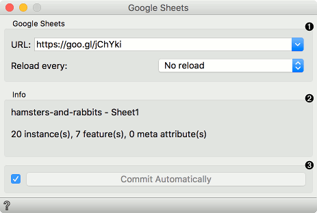
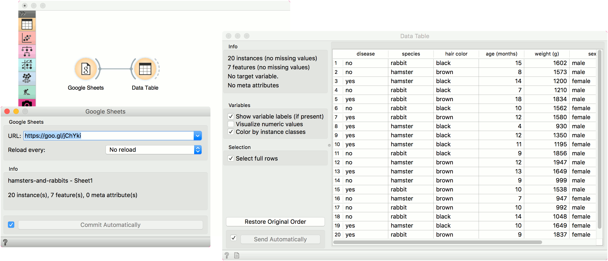

Google Sheets
=============

Read data from a Google Sheets spreadsheet.

**Outputs**

- Data: data set from the Google Sheets service.

Description
-----------

The widget reads data from the [Google Sheets service](https://docs.google.com/spreadsheets). To use the widget, click the Share button in a selected spreadsheet, copy the provided link and paste it into the widget's URL line. Press enter to load the data. To observe the data in real time, use the Reload function.

1. Enter the link to the spreadsheet. Press Enter to load the data. Set reload if you wish to observe the updates in real time.
2. Information on the data set: name and attributes.
3. If *Commit Automatically* is ticked, the data will be automatically communicated downstream. Alternatively, press *Commit*.

Example
-------

This widget is used for loading the data. We have used the link from the Google Sheets: [https://goo.gl/jChYki](https://goo.gl/jChYki). This is a fictional data on hamsters and rabbits, of which some have the disease and some don't. Use the **Data Table** to observe the loaded data in a spreadsheet.

