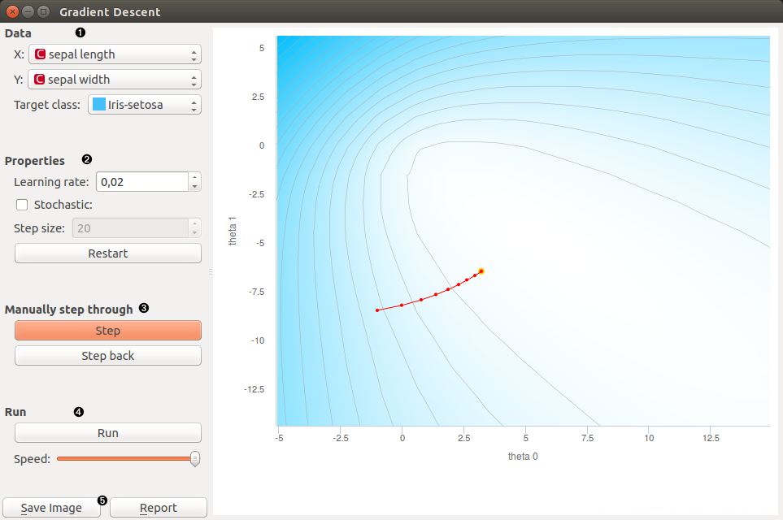
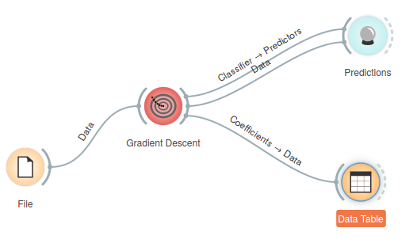
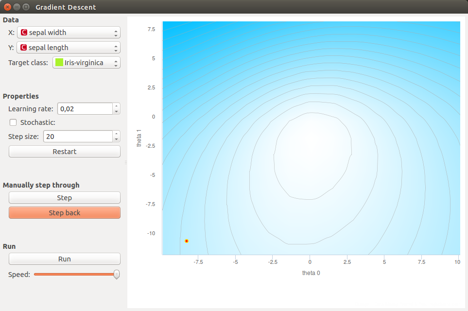
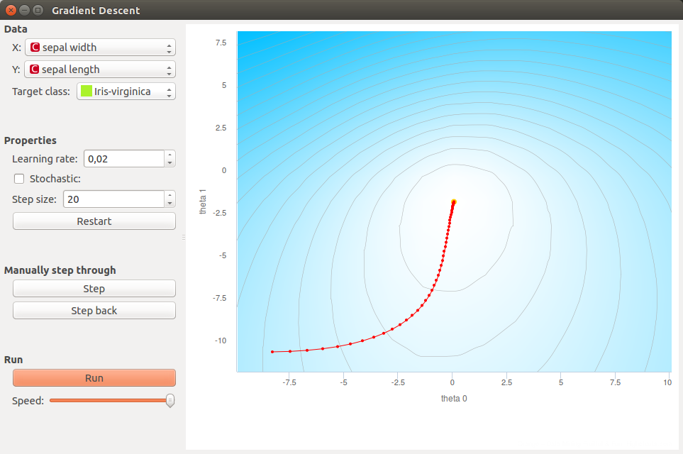
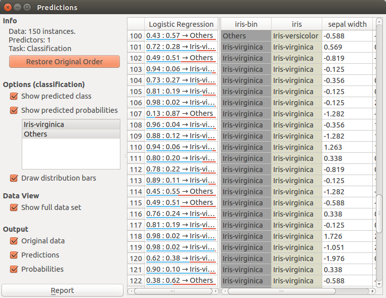
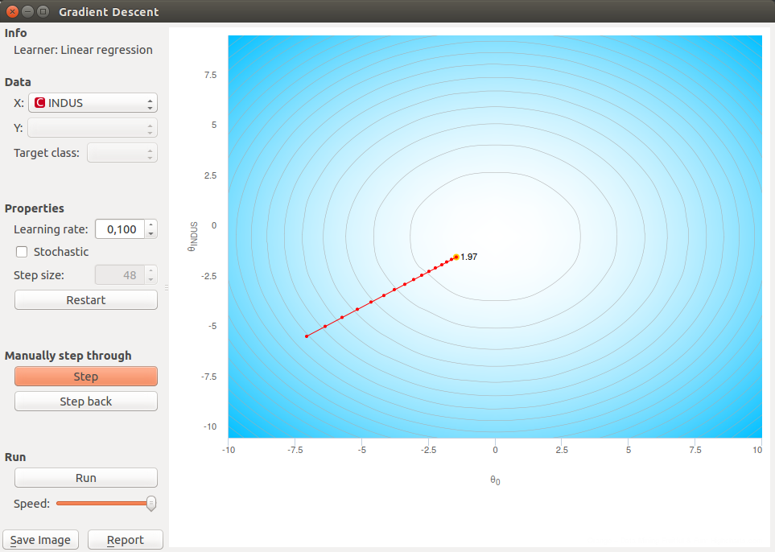

Gradient Descent
================

Educational widget that shows the gradient descent algorithm on a logistic or linear regression.

**Inputs**

- Data: input data set

**Outputs**

- Data: data with columns selected in the widget
- Classifier: model produced at the current step of the algorithm.
- Coefficients: coefficients at the current step of the algorithm.

Description
-----------

This widget incrementally shows steps of [gradient descent](https://en.wikipedia.org/wiki/Gradient_descent) for a logistic or linear regression. Gradient descent is demonstrated on two attributes that are selected by the user.

Gradient descent is performed on logistic regression if the class in the data set is categorical and linear regression if the class is numeric.

1. Select two attributes (**x** and **y**) on which the gradient descent algorithm is preformed. Select the **target class**. It is the class that is classified against all other classes.
2. **Learning rate** is a step size in the gradient descent
   With **stochastic** checkbox you can select whether gradient descent is [stochastic](https://en.wikipedia.org/wiki/Stochastic_gradient_descent) or not.
   If stochastic is checked you can set **step size** that is amount of steps of stochastic gradient descent performed in one press on step button.
   **Restart**: start algorithm from the beginning
3. **Step**: perform one step of the algorithm
   **Step back**: make a step back in the algorithm
4. **Run**: automatically perform several steps until the algorithm converges
   **Speed**: set speed of the automatic stepping
5. **Save Image** saves the image to the computer in a .svg or .png
   format.
   **Report** includes widget parameters and visualization in the report.

Example
-------

In Orange we connected *File* widget with *Iris* data set to the *Gradient Descent* widget. Iris data set has discrete class, so *Logistic regression* will be used this time. We connected outputs of the widget to *Predictions* widget to see how the data are classified and the *Data Table* widget where
we inspect coefficients of logistic regression.

We open the *Gradient Descent* widget and set *X* to *sepal width* and *Y* to *sepal length*. Target class is set to *Iris-virginica*. We set *learning rate* to 0.02. With a click in the graph we set the initial coefficients (red dot).

We perform step of the algorithm by pressing the **Step** button. When we get bored with clicking we can finish stepping by pressing on the **Run** button.

If we want to go back in the algorithm we can do it by pressing **Step back** button. This will also change the model. Current model uses positions of last coefficients (red-yellow dot).

In the end we want to see the predictions for input data so we can open the *Predictions* widget. Predictions are listed in the left column. We can compare this predictions to the real classes.

If we want to demonstrate the *linear regression* we can change the data set to *Housing*. This data set has a continuous class variable. When using linear regression we can select only one feature which means that our function is linear. Another parameter that is plotted in the graph is [intercept](https://en.wikipedia.org/wiki/Y-intercept) of a [linear function](https://en.wikipedia.org/wiki/Linear_function).

This time we selected *INDUS* as an [independent variable](https://en.wikipedia.org/wiki/Dependent_and_independent_variables). In the widget we can make the same actions as before. In the end we can also check the predictions for each point with the *Predictions* widget. And check coefficients of linear regression in a *Data Table*.

