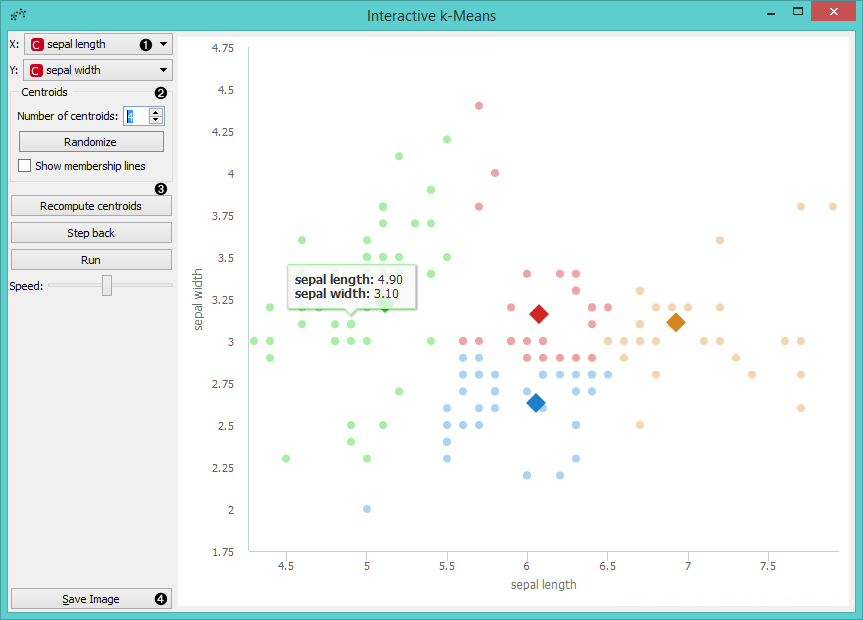
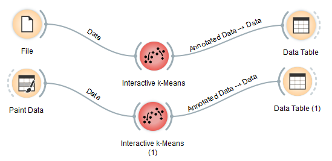
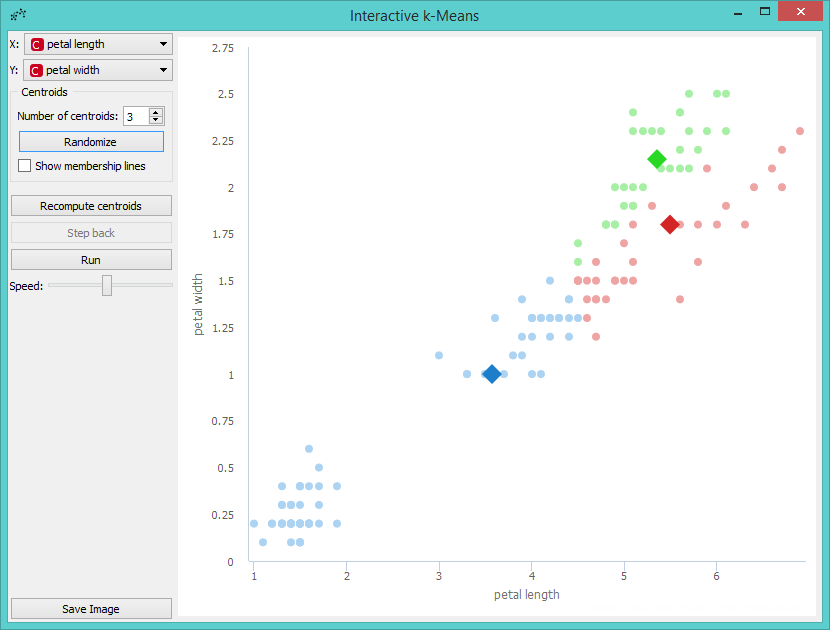
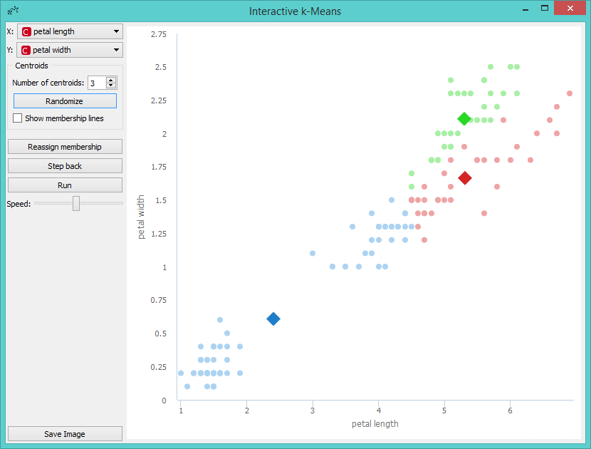
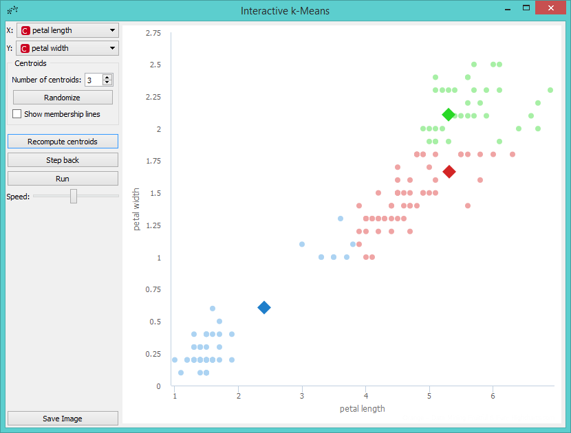
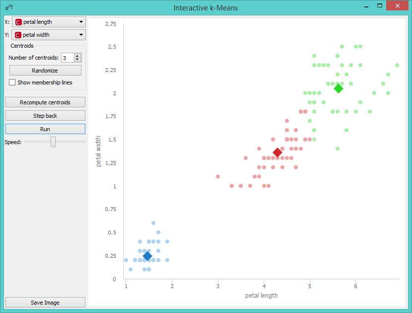
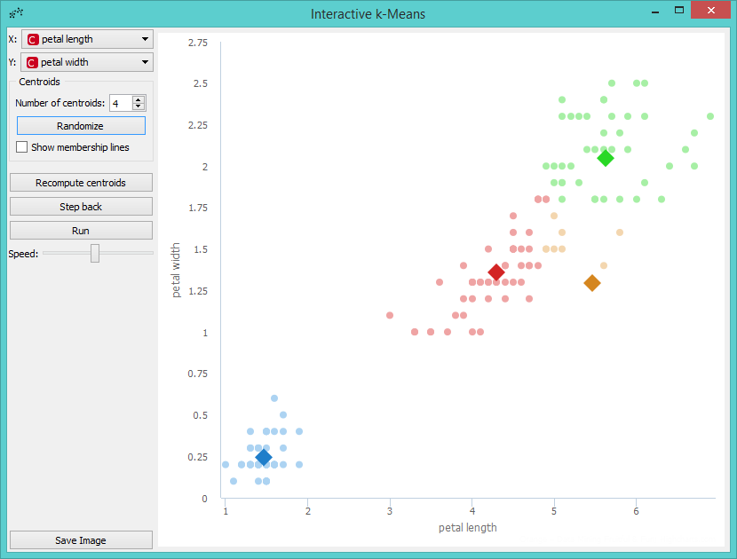
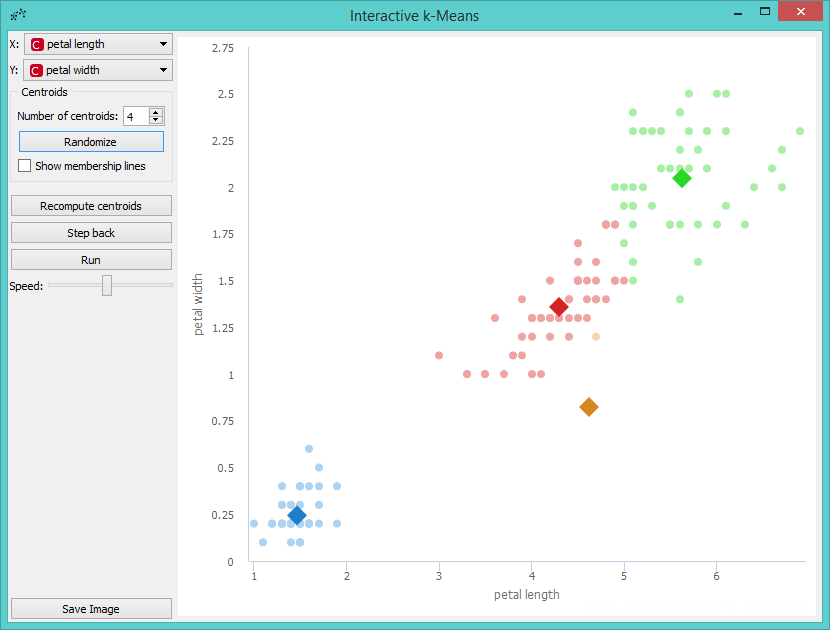
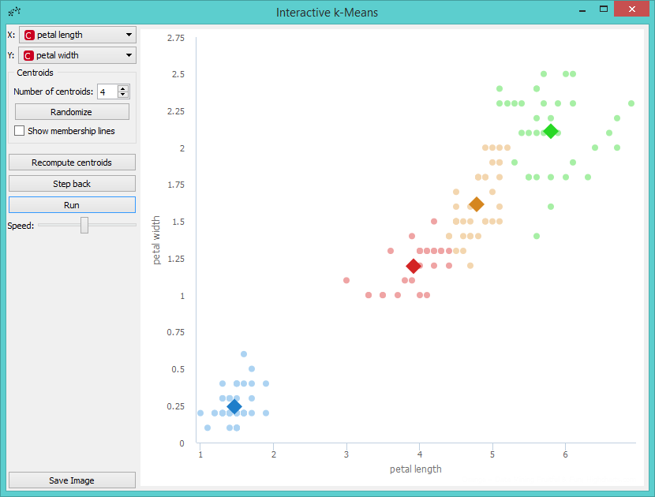

Interactive k-Means
===================

Educational widget that shows the working of a k-means clustering.

**Inputs**

- Data: input data set

**Outputs**

- Data: data set with cluster annotation
- Centroids: centroids position

Description
-----------

The aim of this widget is to show the working of a [k-means clustering algorithm](https://en.wikipedia.org/wiki/K-means_clustering) on two attributes from a data set. The widget applies k-means clustering to the selected two attributes step by step. Users can step through the algorithm and see how it works.

1. Select attributes for **x** and **y** axis.
2. *Number of centroids*: set the number of centroids.
   *Randomize*: randomly assigns position of centroids. If you want to add centroid on a particular position in the graph, click on this position. If you want to move the centroid, drag and drop it on the desired position.
   *Show membership lines*: if ticked, connection between data points and closest centroids are shown.
3. **Recompute centroids** or **Reassign membership**: step through different stages of the algorithm. *Recompute centroids* moves centroids to new positions, based on the most central position of the data assigned to the centroid. *Reassign membership* reassigns data points to the centroid they are the closest to.
   **Step back**: make a step back in the algorithm.
   **Run**: step through the algorithm automatically.
   **Speed**: set the speed of automatic stepping.
4. *Save Image* saves the image to the computer in a .svg or .png format.

Example
-------

Here are two possible schemas that show how the **Interactive k-Means** widget can be used. You can load the data from **File** or use any other data source, such as **Paint Data**. Interactive k-Means widget also produces a data table with results of clustering and a table with centroids positions. These data can be inspected with the
**Data Table** widget.

Let us demonstrate the working of the widget on *Iris* data set. We provide the data using **File**. Then we open **Interactive k-Means**. Say, we will demonstrate k-Means on *petal length* and *petal width* attributes, so we set them as *X* and *Y* parameters. We also decided to perform clustering for 3 clusters. This is set as the *Number of centroids*.

If we are not satisfied with positions of centroids we can change them with a click on the **Randomize** button. Then we perform the first recomputing of centroids with a click on the **Recompute centroids**. We get the following image.

The next step is to reassign membership of all points to the closest centroid. This is performed with a click on the **Reassign membership** button.

Then we repeat these two steps until the algorithm converges. This is the final result.

Perhaps we are not satisfied with the result because we noticed that maybe classification into 4 clusters would be better. So we decided to add a new centroid. We can do this by increasing the number of centroids in the control menu or with a click on the position in the graph where we want to place the centroid. We decided to add it with a click. The new centroid is the orange one.

Now we can repeat running the algorithm until it converges again, but before that we will move the new centroid to change the behavior of the algorithm. We grabbed the orange centroid and moved it to the desired position.

Then we press *Run* and observe the centroids while the algorithm converges again.

