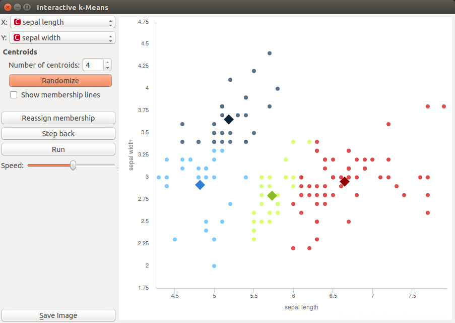
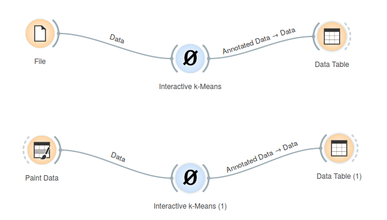
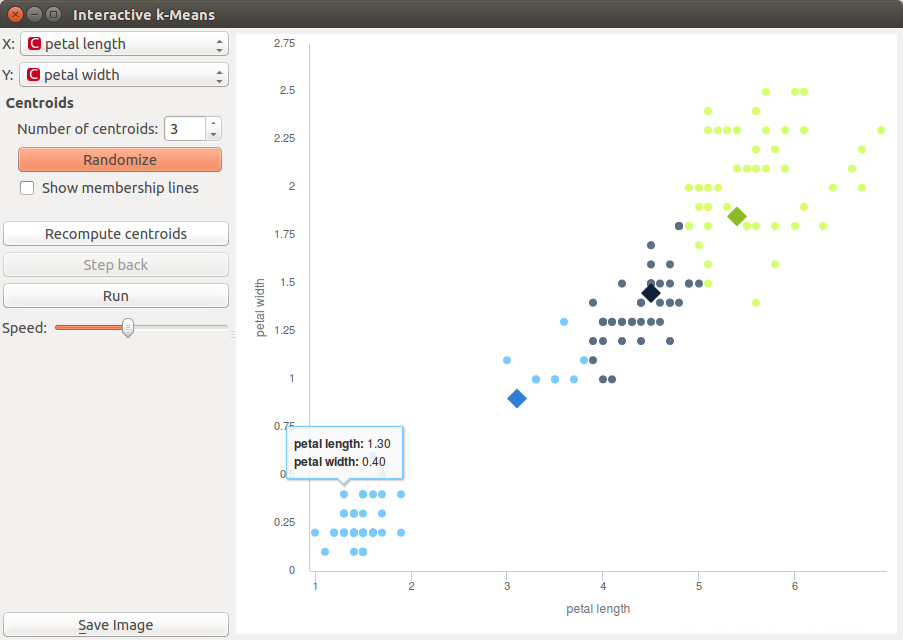
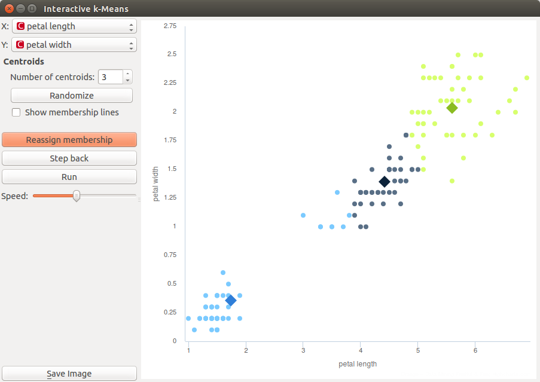
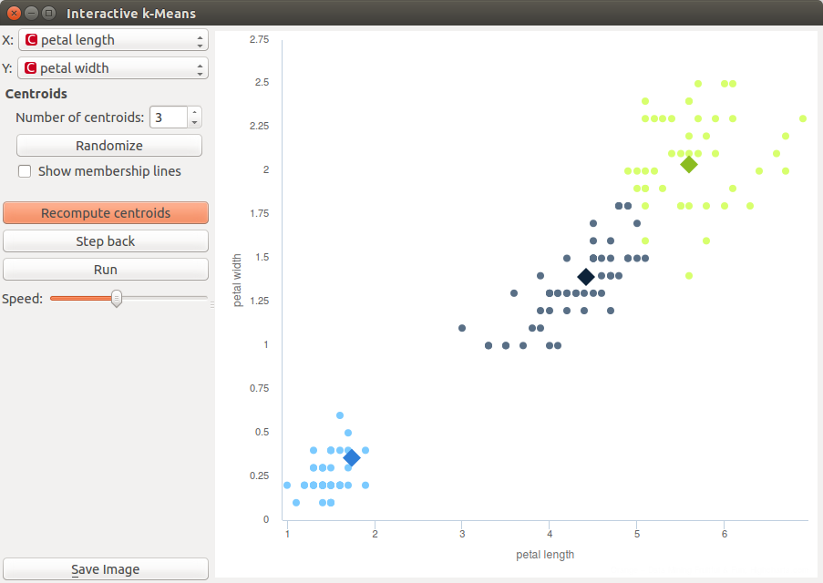
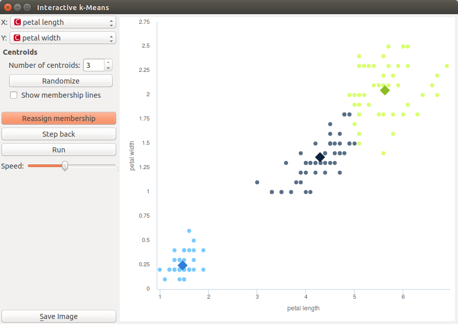
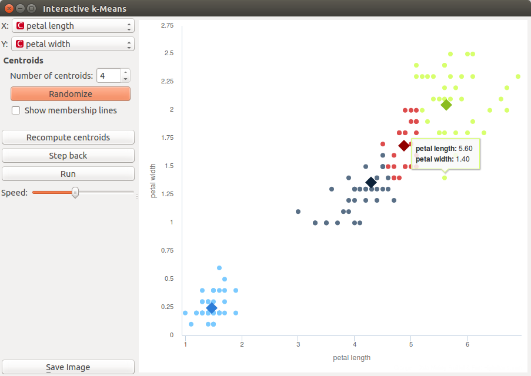
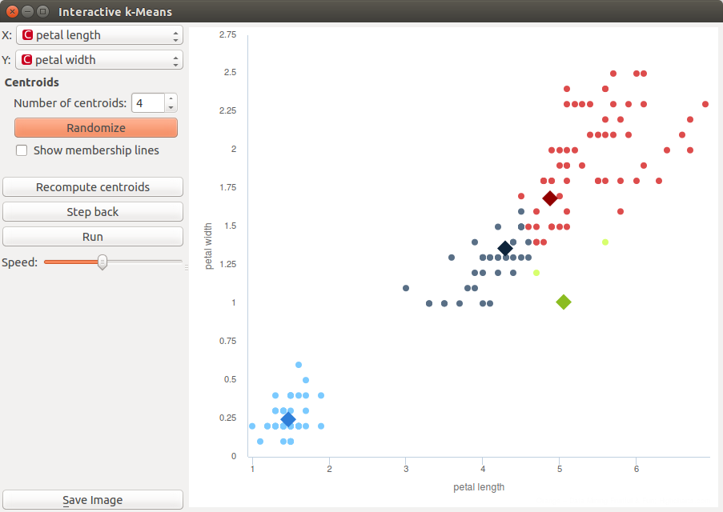

Interactive k-means
===================

.. figure:: icons/mywidget.png

Educational widgets that shows working of a k-means clustering.

Signals
-------
Inputs
~~~~~~
- **Data**
Input data set.

Outputs
~~~~~~~

- **Data**
Data set with clusters labels annotation.

- **Centroids**
Centroids position

Description
-----------

The aim of this widget is to show the working of a k-means clustering algorithm on two attributes from data set.
Widget applies k-means clustering to the selected two attributes step by step. User can step through the algorithm and
see how the algorithm works.

1. Select attribute for **x** axis and attribute for **y** axis.

2. Select number of centroids in the spinner. If you want new random positions of the centroids or restart the algorithm
   in any point, you can click on **Randomize** button. If you want to add centroid on particular position in the graph
   just click on this position. If you want to move centroid, grab it and drop it on the desired position.

3. Step through the algorithm with **Recompute centroids** and **Reassign membership**. If you want to make step back
   use **Step back** button. You can also step automatically with pressing on **Run** button. **Speed** spinner can be used
   to set the speed of automatic stepping.

Example
-------

Here are two possible schemas that shows how the **Interactive k-Menas** widget can be used. You can load data form
**File** or use any other data source, such as **Paint Data**. Interactive k-Menas widget also produce the data table
with results of clustering and table with centroids positions. That can be inspected with **Data Table** widget or andy
other widgets (e.g. Scatter Plot).

Let us demonstrate the working of the widget on *Iris Dataset*.

We provide data from data set using **File widget**. Then we open **Interactive k-Means** widget. We decided that we
will demonstrate k-Menas on *petal length* and *petal width* attributes, so we set them as *X* and *Y* parameters.
We also decided to perform a clustering in 3 clusters. This is set as *Number of centroids*. After that we get this
figure.

If we are not satisfied with positions of centroids we can change it with click on **Randomize** button. Then we
perform first recomputing of centroids with click on **Recompute centroids** button. We get following image.

The next step is to reassign membership of point to the closest centroid. It is performed with click on
**Reasign membership** button.

Then we repeat that two steps until algorithm converges. It is final result.

But we are not satisfied with result because we noticed that maybe classification in 4 clusters would be better.
So we decided to add a new centroid. We can make it with increasing number of centroids in left menu or with click on
position in graph where we want to place the centroid. We decided to add it with click. New centroid is red one.

Now we can repeat some steps that algorithm converges again, but before we will move green centroid to change the
behavior of the algorithm. We grab green centroid and moved it to desired position.

