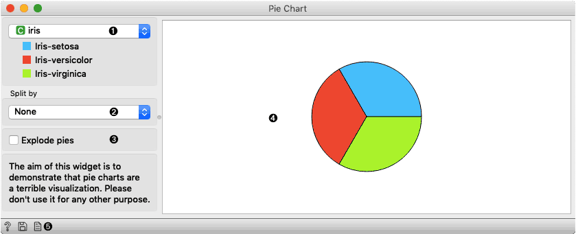
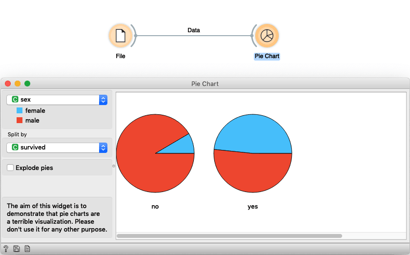

Pie Chart
=========

The widget for visualizing discrete attributes in the pie chart.

**Inputs**

- Data: input data set

The aim of this widget is to demonstrate that pie charts are a terrible visualization. Please don't use it for any other purpose.

1. Select the attribute you want to visualize.
2. Select the attribute which is used to split data in more charts.
3. Check if you want pies to be exploded (parts of the pie will have space in between).
4. You will see your data visualized here.
5. With those buttons, you can either get help, save the plot, or include plots in the report.

Example
-------

We load the Titanic dataset in File widget and connected the data to Pie Chart. Here we show the distribution of gender data and split pies by survived attributes. We notice that in the group of passengers that did not survive there are mainly male while there is a higher proportion of women in the group of people that survived. While the pie chart can shed some light of data we still suggest using more informative visualizations, e.g. Box Plot.

