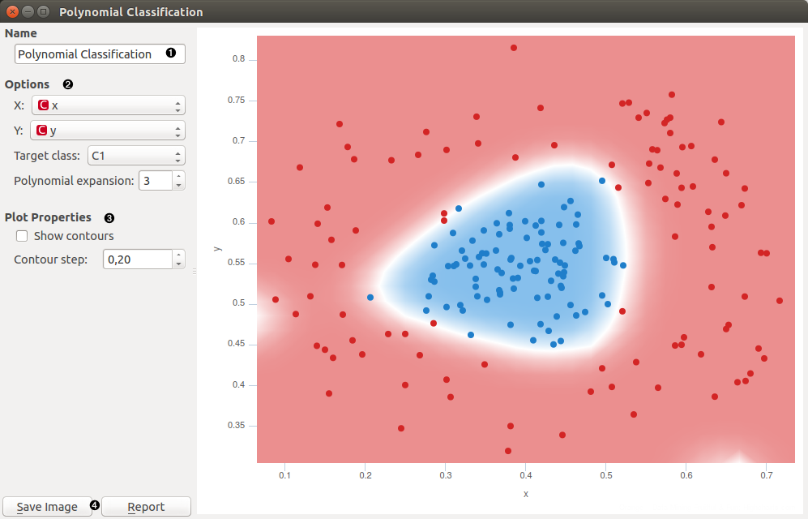
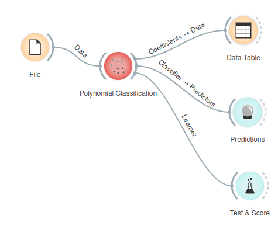
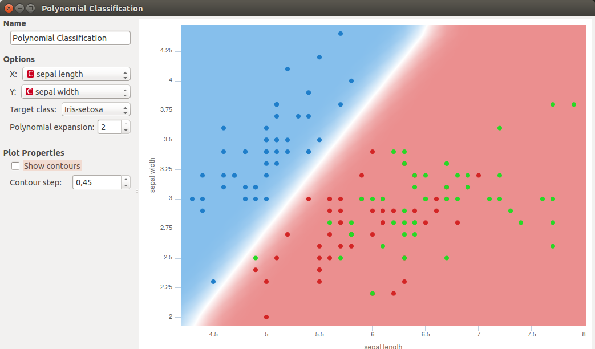
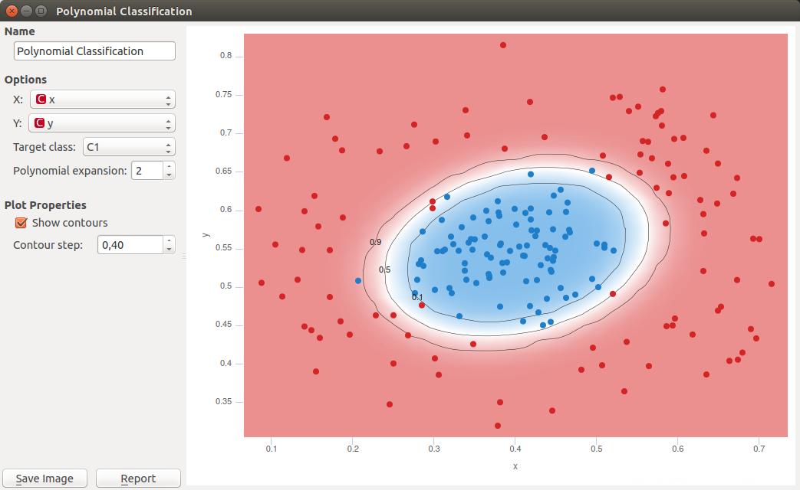

Polynomial Classification
=========================

Educational widget that visually demonstrates classification in two classes for any classifier.

**Inputs**

- Data: input data set
- Preprocessor: data preprocessors
- Learner: classification algorithm used in the widget. Default set to Logistic Regression Learner.

**Outputs**

- Learner: classification algorithm used in the widget
- Classifier: trained classifier
- Coefficients: classifier coefficients if it has them

Description
-----------

This widget interactively shows classification probabilities for classification in two classes using color gradient and contour lines for any classifiers from the *Model* section. In the widget, polynomial expansion can be set. Polynomial expansion is a regulation of the degree of polynom that is used to transform the input data and has an effect on the classification. If polynomial expansion is set to 1 it means that untransformed data are used in the regression. If polynomial expansion is set to 2 we get following additional attributes:

- first attribute on power 2
- first attribute * second attribute
- second attribute on power 2

1. Classifier name.
2. *X*: attribute on axis x.
   *Y*: attribute on axis y.
   *Target class*: Class in input data that is classified apart from others classes because widget support only two class classification.
   *Polynomial expansion*: Degree of polynom that is used to transform the input data.
3. *Show contours*: Enable contour lines in the graph.
   *Contour step*: Density of contour lines.
4. *Save Image* saves the image to the computer in a .svg or .png format.
   *Report* includes widget parameters and visualization in the report.

Example
-------

We loaded the *iris* data set with the File widget and connected it to the *Polynomial Classification* widget. To demonstrate output connections, we connected *Coefficients* to the Data Table widget where we can inspect their values. *Learner* output can be connected to *Test & Score* widget and *Classifier* to *Predictions widget*.

In the widget we selected *sepal length* as our *X* variable and *sepal width* as our *Y* variable. We set the *Polynomial expansion* to 1. That performs classification on non transformed data. Result is shown in the figure below. Color gradient represents the probability of the area to belong to a particular class value. Blue color represents classification to the target class and red color classification to the class with all other examples.

In the next example we changed the *File* widget to the *Paint data* widget and plotted some custom data. Because the center of the data is of one class and the surrounding of another, *Polynomial expansion* degree 1 does not perform good classification. We set *Polynomial expansion* to 2 and get the classification in the figure below. We also selected to use contour lines.

