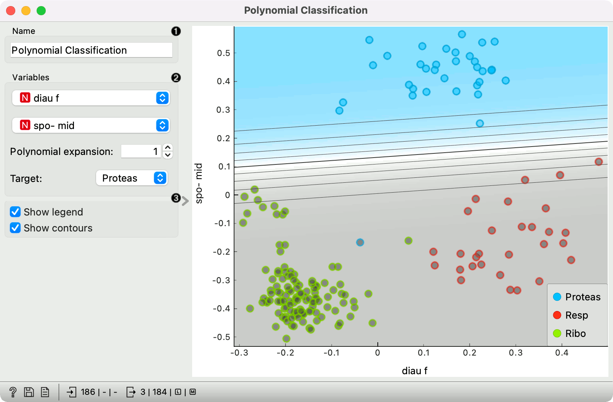
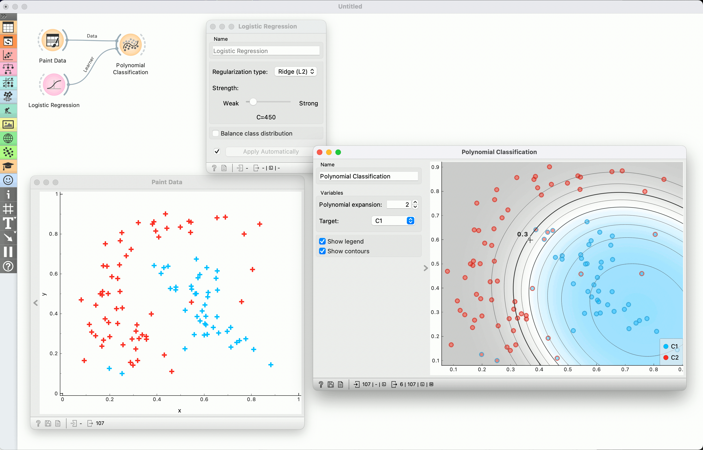
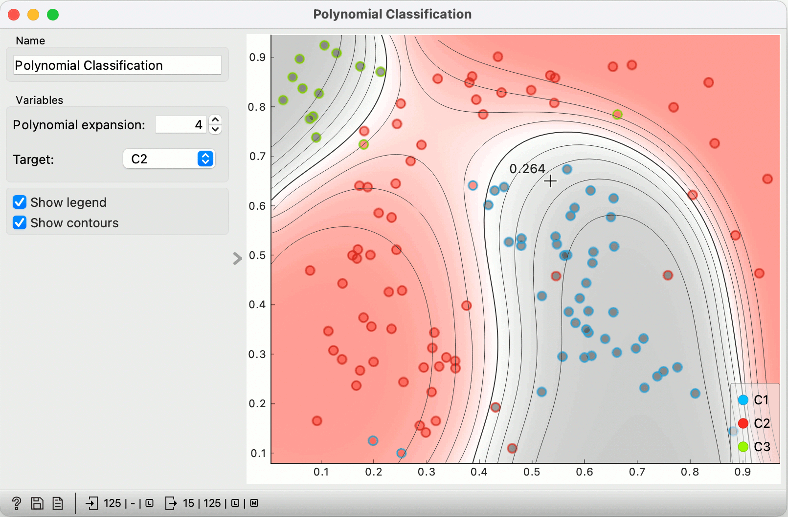

Polynomial Classification
=========================

Educational widget that visually demonstrates classification in two-dimensional space.

**Inputs**

- Data: input data set
- Preprocessor (optional): data preprocessors
- Learner (optional): classification algorithm used in the widget (default:Logistic Regression)

**Outputs**

- Learner: classification algorithm used in the widget
- Classifier: trained classifier
- Coefficients: classifier coefficients if it has them

Description
-----------

This widget interactively shows classification probabilities using contours and color gradient for any classifier. The widget is particularly useful for showing effects of polynomial expansion (by adding terms like *xiyj* where *i + j* is at most the selected degree) and of regularization*.

By default, the widget uses non-regularized logistic regreesion. Manually attaching learner, for instance the Logistic Regression widget, allows us to control the regularization strength.

The outline of the shown data points indicates the actual class, and the inside shows the prediction by the model. In non-binary classification, points predicted to non-target classes are painted gray.

1. Classifier name.
2. Variables: variables used for classification; options shown only if data contains more than two independent variables.
   *Polynomial expansion*: Degree of polynomial expansion.
   *Target class*: the target to which the shown probabilities apply. In non-binary classification, other classes are merged.
3. *Show legend*: Show color legend.
   *Show contours*: Show contour lines for probabilities.

Example
-------

We painted some data using the Paint widget and fed it to Polynomial Classification. We also added Logistic Regression to control the regularization.

Setting the polynomial expansion to 2 allows the classifier to construct boundaries as 2 degree polynomials. Hovering over a contour line shows the predicted probability of the target class (in this case C1) for points on that line. Moving the mouse elsewhere shows a probability at some particular point.

Red points with blue outline are "blue" data instances that are misclassified as red, and vice versa.

Changing the regularization (in Logistic regression widget) allows us to observe how the contour lines spread and shrink.

We added another class, chose C2 as the target, increased the polynomial expansion to 4 and weaken the regularization (in Logistic regression widget).

Outlines still represent the original classes. Instances of the target classes are colored red, the other two classes are gray.

Hovering at any point shows us the probability for red (e.g. 0.264).

