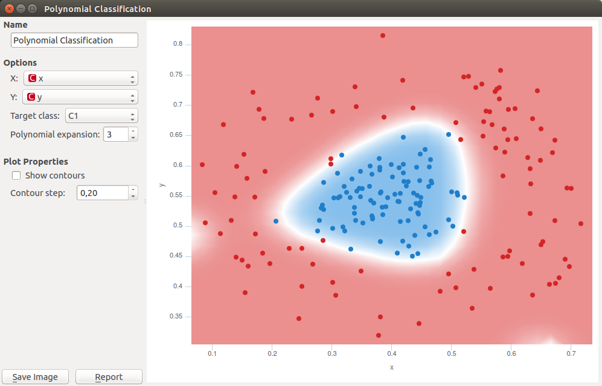

Polynomial Classification
=========================

Educational widget that visually demonstrates classification in two classes for any classifier.

Signals
-------

**Inputs**

- **Data**

Input data set.

- **Preprocessor**

Data preprocessors.

- **Learner**

Classification algorithm used in the widget. Default set to Logistic Regression Learner.

**Outputs**

- **Learner**

Classification algorithm used in the widget.

- **Classifier**

Trained classifier.

- **Coefficients**

Classifier coefficients if it has them.

Description
-----------

This widget interactively shows classification probabilities for classification in two classes using color gradient and
contour lines for any classifiers form *Orange Classification* module.
In the widget, `polynomial expansion <https://en.wikipedia.org/wiki/Polynomial_expansion>`__ can be set.
Polynomial expansion is a regulation of the degree of polynom that is used to transform the input data and has an effect
on classification. If polynomial expansion is set to 1 it means that untransformed data are used in the
regression.

1. Classifier name.

2. *X*: attribute on axis x.

   *Y*: attribute on axis y.

   *Target class*: Class in input data that is classified apart from others classes because widget support only two
    class classification.

   *Polynomial expansion*: Degree of polynom that is used to transform the input data.

3. *Save Image* saves the image to the computer in a .svg or .png
   format.

   *Report* includes widget parameters and visualization in the report.

Example
-------

.. figure:: images/polyclassificationmain.png

We loaded *iris* data set with the :doc:`File<../orange3/doc/visual-programming/source/widgets/data/file>` widget and
connected it to *Polynomial Classification* widget.
To demonstrate outputs connections we connected *Coefficients* to Data Table widget where we can inspect their values.
*Learner* output can be connected to Test & Score widget and *Classifier* ro Predictions widget.

In the widget we selected *sepal length* as our *X* variable and *sepal width* as our *Y* variable.
We set *Polynomial expansion* to 1. That performs classification on non changed data. Result is show on the figure
below. Color gradient represents the probability to classify data on its position in one of two classes. Blue color
represents classification in target class and red color classification in class with all others examples.

.. figure:: images/polyclassification1.png

In next example we changed *File* widget with *Paint data* widget and plotted some custom data. Because center of data
has one class and scrounging another *Polynomial expansion* degree 1 does not perform good classification. We set
*Polynomial expansion* to 2 and got this classification. We also selected to use contour lines.

.. figure:: images/polyclassification2.png
