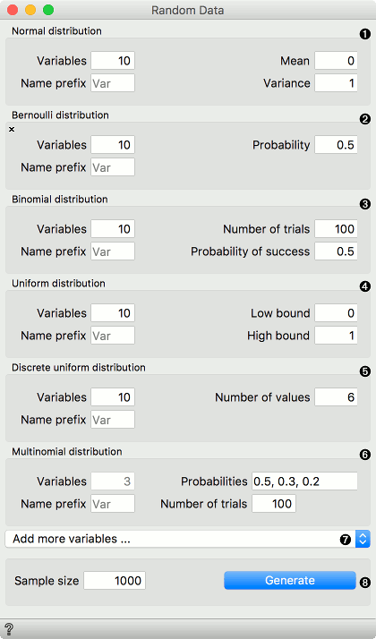
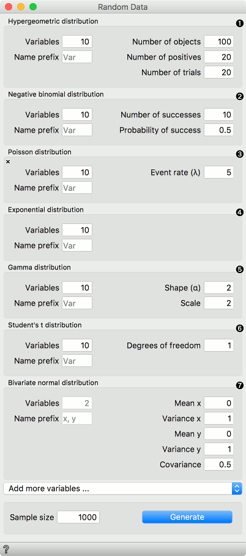
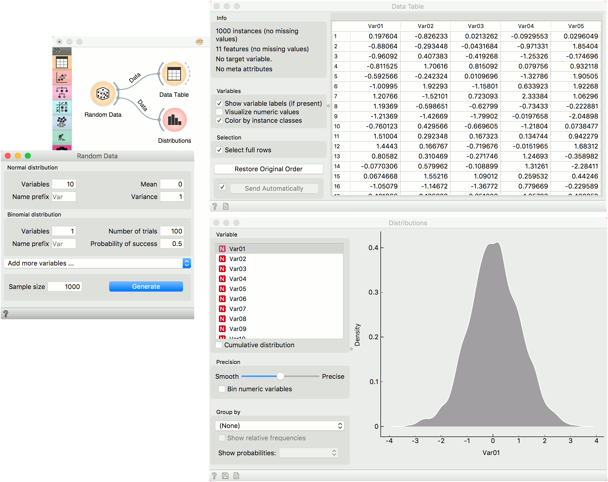

Random Data
===========

Generate random data sample.

**Inputs**

- None

**Outputs**

- Data: randomly generated data

**Random Data** allows creating random data sets, where variables correspond to the selected distributions. The user can specify the number of rows (samples) and the number of variables for each distribution. Distributions from the Scipy's [stats](https://docs.scipy.org/doc/scipy/reference/stats.html) module are used.

1. [Normal](https://docs.scipy.org/doc/scipy/reference/generated/scipy.stats.norm.html#scipy.stats.norm): A normal continuous random variable. Set the number of variables, the mean and the variance.
2. [Bernoulli](https://docs.scipy.org/doc/scipy/reference/generated/scipy.stats.bernoulli.html#scipy.stats.bernoulli): A Bernoulli discrete random variable. Set the number of variables and the probability mass function.
3. [Binomial](https://docs.scipy.org/doc/scipy/reference/generated/scipy.stats.binom.html#scipy.stats.binom): A binomial discrete random variable. Set the number of variables, the number of trials and probability of success.
4. [Uniform](https://docs.scipy.org/doc/scipy/reference/generated/scipy.stats.uniform.html#scipy.stats.uniform): A uniform continuous random variable. Set the number of variables and the lower and upper bound of the distribution.
5. [Discrete uniform](https://docs.scipy.org/doc/scipy/reference/generated/scipy.stats.randint.html#scipy.stats.randint): A uniform discrete random variable. Set the number of variables and the number of values per variable.
6. [Multinomial](https://docs.scipy.org/doc/scipy/reference/generated/scipy.stats.multinomial.html#scipy.stats.multinomial): A multinomial random variable. Set the probabilities and the number of trials. The probabilities should sum to one. The number of probabilities corresponds to the final number of variables generated.
7. *Add more variables...* enables selecting new distributions from the list and with that adding additional variables. Distributions can be removed by pressing an X in the top left corner of each distribution.
8. Define the sample size (i.e. number of rows, default 1000) and press *Generate* to output the data set.

1. [Hypergeometric](https://docs.scipy.org/doc/scipy/reference/generated/scipy.stats.hypergeom.html#scipy.stats.hypergeom): A hypergeometric discrete random variable. Set the number of variables, number of objects, positives and trials.
2. [Negative binomial](https://docs.scipy.org/doc/scipy/reference/generated/scipy.stats.nbinom.html#scipy.stats.nbinom): A negative binomial discrete random variable. Set the number of variables, number of successes and the probability of a success.
3. [Poisson](https://docs.scipy.org/doc/scipy/reference/generated/scipy.stats.poisson.html#scipy.stats.poisson): A Poisson discrete random variable. Set the number of variables and the event rate (expected number of occurrences).
4. [Exponential](https://docs.scipy.org/doc/scipy/reference/generated/scipy.stats.expon.html#scipy.stats.expon): An exponential continuous random variable. Set the number of variables.
5. [Gamma](https://docs.scipy.org/doc/scipy/reference/generated/scipy.stats.gamma.html#scipy.stats.gamma): A gamma continuous random variable. Set the number of variables, the shape and scale. The larger the scale parameter, the more spread out the distribution.
6. [Student's t](https://docs.scipy.org/doc/scipy/reference/generated/scipy.stats.t.html#scipy.stats.t): A Student’s t continuous random variable. Set the number of variables and the degrees of freedom.
7. [Bivariate normal](https://docs.scipy.org/doc/scipy/reference/generated/scipy.stats.multivariate_normal.html#scipy.stats.multivariate_normal): A multivariate normal random variable where the number of variables is fixed to 2. The number of variables is set to two and cannot be changed. Set the mean and variance of each variable and the covariance matrix of the distribution.

Example
-------

We normaly wouldn't create a data set with so many different distributions but rather, for instance, a set of normally distributed variables and perhaps a binary variable, which we will use as the target variable. In this example, we use the default settings, which generate 10 normally distributed variables and a single binomial variable.

We observe the generated data in a **Data Table** and in **Distributions**.

