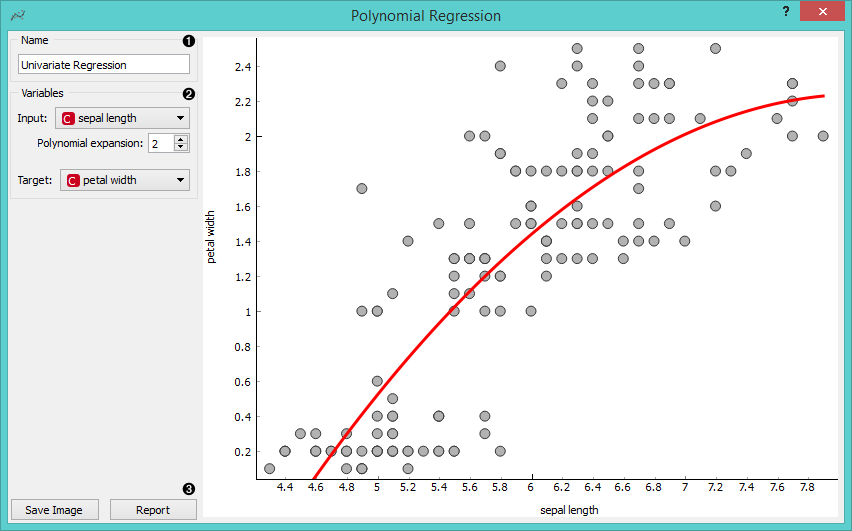
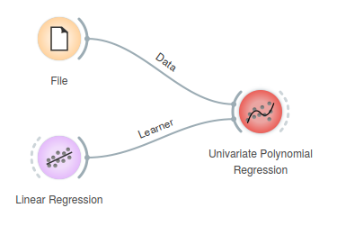
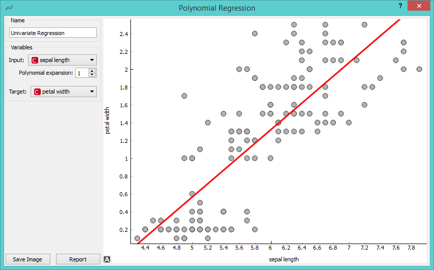
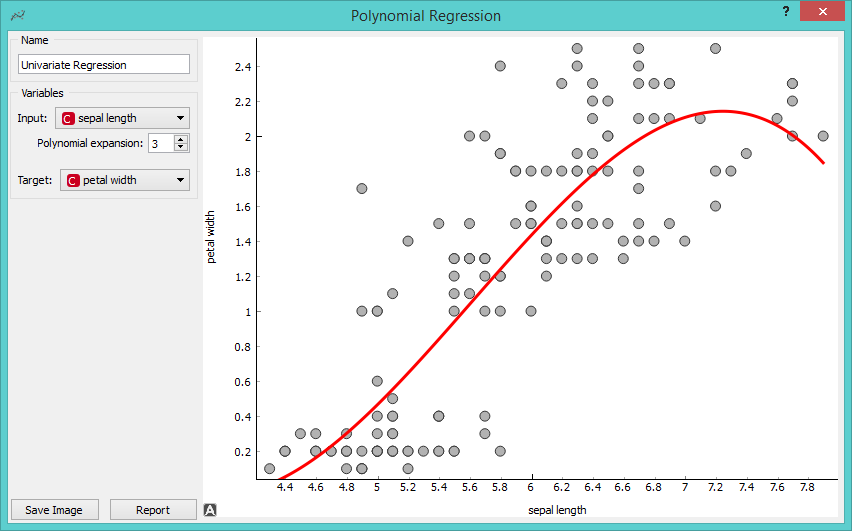
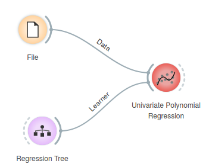
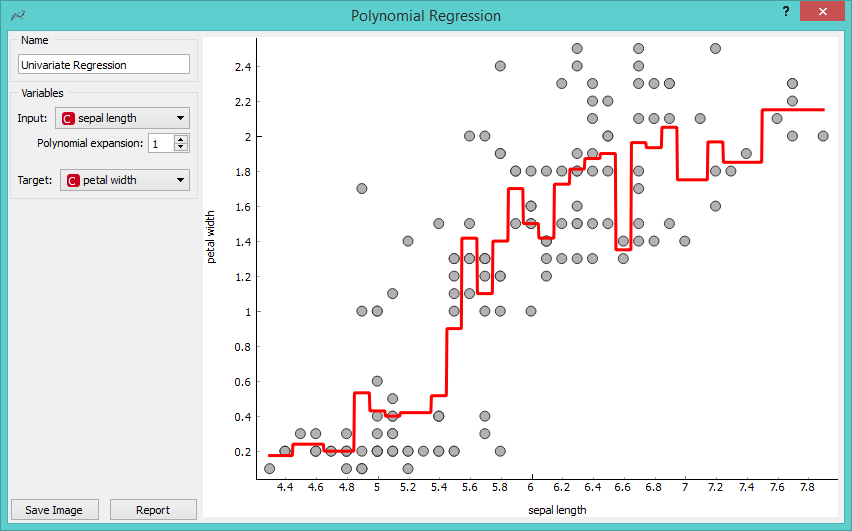

Polynomial Regression
=====================

Educational widget that interactively shows regression line for different regressors.

Signals
-------

**Inputs**:

- **Data**

Input data set. It needs at least two continuous attributes.

- **Preprocessor**

Data preprocessors.

- **Learner**

Regression algorithm used in the widget. Default set to Linear Regression.

**Outputs**:

- **Learner**

Regression algorithm used in the widget.

- **Predictor**

Trained regressor.

- **Coefficients**

Regressor coefficients if it has them.

Description
-----------

This widget interactively shows regression line using any of the regressors from *Orange3 Regression* module. 
In the widget, `polynomial expansion <https://en.wikipedia.org/wiki/Polynomial_expansion>`__ can be set. 
Polynomial expansion is a regulation of the degree of polynom that is used to transform the input data and has an effect 
on the shape of a curve. If polynomial expansion is set to 1 it means that untransformed data are used in the regression.

1. Regressor name.

2. *Input*: independent variable on axis x.

   *Polynomial expansion*: degree of polynomial expansion.

   *Target*: dependent variable on axis y.

3. *Save Image* saves the image to the computer in a .svg or .png
   format.
   
   *Report* includes widget parameters and visualization in the report.

Example
-------

We loaded *iris* data set with the **File** widget. 
Then we connected **Linear Regression** learner to the **Polynomial Regression** widget.
In the widget we selected *petal length* as our *Input* variable and *petal width* as our *Target* variable.
We set *Polynomial expansion* to 1 which gives us a linear regression line. The result is shown on the figure below.

The line can fit better if we increase the **Polynomial expansion** parameter. Say, we set it to 3.

To observe different results, change **Linear Regression** to any other regression learner from Orange. Example below is done with **Regression Tree** learner.

