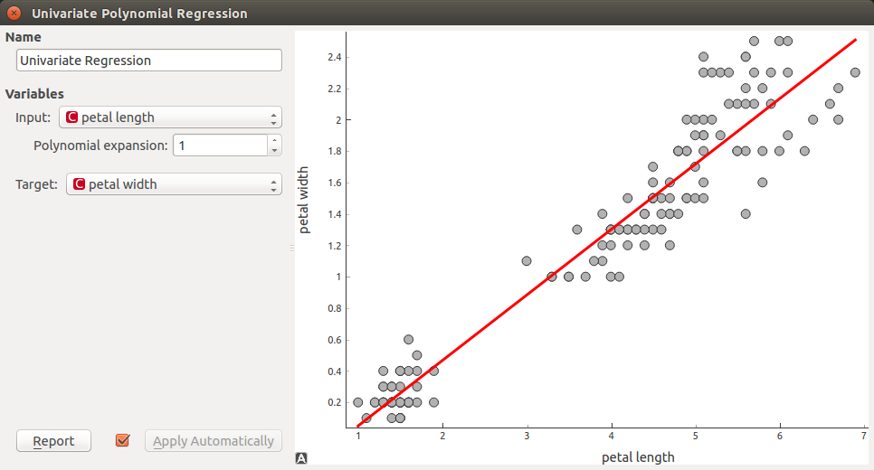
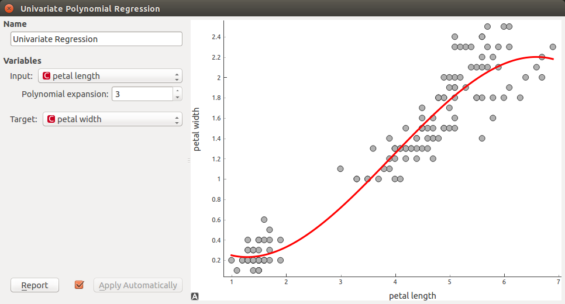
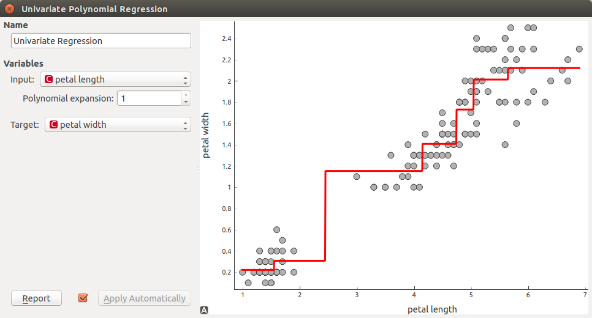

Univariate Polynomial Regression
================================

.. figure:: icons/polynomialregression.png

Educational widgets that interactively shows what regression line is provided for with different regressors.

Signals
-------
Inputs
~~~~~~

- **Data**

Input data set.

- **Preprocessor**

Data preprocessors.

- **Learner**

Regression algorithm used in the widget.

Outputs
~~~~~~~

- **Learner**

Regression algorithm used in the widget.

- **Predictor**

Trained regressor.

- **Coefficients**

Regressor coefficients if it has them.

Description
-----------

This widget interactively shows regression line using different regressors from Orange3 Regression module provided on
the input. In widget **Polynomial expansion** can be set. Polynomial expansion is regulation of the degree
of polynom that is used to transform input data and has an effect on the shape of a curve. If polynomial expansion is
set to 1 it means that untransformed data are used in regression.

.. figure:: images/polyregressionmain.png

1. Provide data with at least two continuous attributes on input. Also provide any regression learner on input (if
   not provided *Linear Regression* is used.

3. Open widget and select **Imput** and **Target** feature in a dropdown menu.

2. Select the degree of a polynomial expansion. With changing it you can see the difference between the
   regression lines with different degree.

3. **Apply** button chan be used to submit changes on output.

Example
-------

With *File* widget we loaded *Iris* data set. We also connect *Linear Regression* learner as show on figure above.
In widget we selected *petal length* as an **Input** feature and *petal width* as a **Target**.
We set **Polynomial expansion** to 1 what gives us linear regression line. Result is show on the figure below.

We noticed that line can fit better if we increase **Polynomial expansion** parameter. We set it to 3.

We decided that results that we got with *Linear Regression* does not satisfy us so we changed the learner with
*Regression Tree* learner.

.. figure:: images/polyregressiontree1.png

